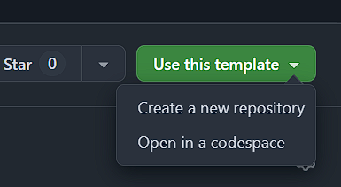

    <h1>Latex Template</h1>
    implementing some build process optimizations using VS Code and Docker.

---

## Usage

> Requirements: VS Code, Docker, Python

1. Clone or download the repository
2. Open folder with VS Code
3. Copy the keybindings from within `.vscode/keybindings.json` into the VS Code shortcuts (`Ctrl+K` `Ctrl+S`)
4. Apply changes to the LaTeX document
5. Hit `Ctrl+Alt+S`
6. Observe the build process
7. Open the generated PDF to view the results

You can also use this template directly through GitHub.

## Implemented features

- Pregenerate glossaries separately
- Precompile the preamble
- Use draft mode the first runs
- Disable console output

## Change requests, proposals or other contributions

Feel free to contribute by opening issues or pull requests if you see some ways for further improvement.
